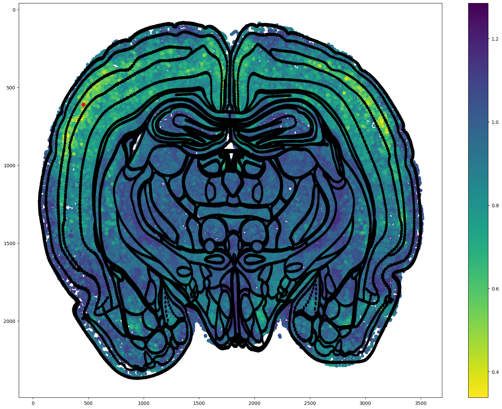

A Visual Query-Driven Search Engine for Brain Tissue Image Analysis

# Paper

[](https://https://github.com/RoysamLab)

## Project description

- will update later...

## How to use

### Installation

You can use `python setup.py develop` to install the environment directly, or manually install the following packages.
requirement pkgs=[
    'torch=2.3.0','numpy=1.26.4',  'torchvision=0.18.0',
    'six=1.16.0', 'h5py=3.11.0', 'Pillow=9.4.0', 'scipy=1.12.0',
    'scikit-learn=1.4.2', 'metric-learn=0.6.2',--pip only--, 'faiss_gpu=1.7.2','infomap=2.8.0', 'scikit-image=0.22.0','tqdm=4.66.4']

and then install itself as a package.

* `cd VisQ-Search-Engine `
* `pip install -e .`

### Data Preparation

You need to train the whole dataset before using the query search engine, after it has been trained, the user can use the list of the locations as the query engine input. 
Thus, we provide the mathod for data preparation so the train process can work on it.
The data preparation is to crop the whole image into several [174,174,10] images.


Here is the method for preparing the dataset:
`python make_blindDS_maui.py`
`--INPUT_DIR <Path to the input dir containing biomarker images>`
`--OUTPUT_DIR <Path to the output dir>`
`--BBXS_FILE <Path to the bbxs_detection.txt file generated from cell nuclei detection module, a file that contains the centroidx,centroidy,xmin/ymin and xmax/ymax>`
`--channel_names <List of filnames for channels in the order: [dapi, histone, neun, s100, olig2, iba1, reca1]>`

Alternatively, there are several default variables that you can change by your need, please check the code in the file.
The input biomarker images are the whole brain images and the output are the cropped [175,172,10] patches.
Below is a sample of how to run the code.
`python make_blindDS_maui.py  --INPUT_DIR=/data/brain/MDA_GBM/1168457/intra_corrected/  --OUTPUT_DIR=/examples/data/MDA_GBM_1168457_whole.2/  --BBXS_FILE=/data/brain/MDA_GBM/1168457/detection_results/bbxs_detection.txt  --DAPI=R1C1.tif --HISTONES=R1C2.tif  --NEUN=R1C3.tif  --S100=R1C4.tif  --OLIG2=R1C5.tif  --IBA1=R1C6.tif  --RECA1=R2C2.tif  --other1=R2C3.tif  --other2=R2C4.tif  --other3=R2C5.tif  `

You can see the example of the data in the bbs_detection.txt.
We recommend you set the file arc as below:

`cluster-contrast-reid`

`├── clustercontrast` 

`├── exaples` 

`│   └──data `

`│   └──logs`

`│   └──pretrained `

`├── results` 

`├── runs` 

`├── bash.sh`

`├── setup.py`

### Train

To train the network, we need several args, here is the explanation:
`CUDA_VISIBLE_DEVICES=0,1,2,3 In default, we train the network in 4 GPUs, corresponding to the variable -j, if you are using another number of GPUs, you need to change the variable -j to the number of the Gpus`

`-b batch size`

`-a backbone network`

`--iters number of the epoch`

`--momentum the momentum of the encoder update rate`

One example for training:
`python VisQ-Search-Engine/examples/triplet_loss_train.py\
  -b 100 -a unet -d brain -dn connectivity0_noRECA_NeuN -nc=5\
  --iters 200 --momentum 0.2 --eps 0.6 --num-instances 16 --height 50 --width 50 --epochs 100 \
  --logs-dir VisQ-Search-Engine/examples/logs/unetg1b1m2_ftTL_myelo22_175/ `

### Query

Run the code in BooleanUser_lhuang.ipynb to see how to interact with your query and the output display with the machine learning model. Before that, you need to prepare the following files:

* pretrained matrix: please find it in examples/logs/<data name, ex:UNet_CA_myelo >/feature_results.h5
* distance rerank: please find it in examples/logs/<data name, ex:UNet_CA_myelo >/rerankingDist.npy
* cosine feature: please find it in examples/logs/<data name, ex:UNet_CA_myelo >/feature_results_Cosine.h5
* h5file: please find it in data/Select_RegionMasked_50.h5
* prepared data crops from target whole brain image, include the mean_std.txt
* Atlas data: please find it in data/Swanson_S1_Atlas_Fit_1.tif
* click keys: please find it in brain/50Plex/S1/classification_table_master.csv
* clicks(Alternatively, can manually selected, or save as a npy file) please find it in /examples/data/clicks/clicks_Swanson0.npy

Calculate thresholding:
<... update later>

The red node is the search engine and the output is the similarity heatmap of the whole brain image. 


Please see more examples with multi-clicks in the jupyter notebook file.
## Acknowledgments

This work was supported by the National Institutes of health (NINDS) under grant
R01NS109118

## License

If you use this codebase in your work, please consider citing:

```bibtex
@article{update later,
    author = {update later},
    title = {update later},
    journal = {update later},
    year = {update later},
    doi = {update later},
}
```
