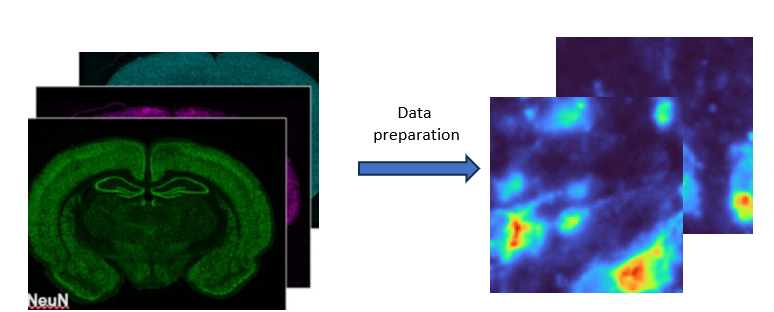

A Visual Query-Driven Search Engine for Brain Tissue Image Analysis

# Paper

[](https://https://github.com/RoysamLab)

## Project description

- Our search engine is built for combining multiplex fluorescence image signals into a single feature space, which then constructs a community map to delineate the similar/different regions in the tissue.

## How to use

### Installation

Please manually install the following packages.
Note that the CUDA driver version should be 12.1, and PyTorch should be 2.3.0.
for pytorch,use`conda install pytorch==2.3.0 torchvision==0.18.0 torchaudio==2.3.0 pytorch-cuda=12.1 -c pytorch -c nvidia`
requirement pkgs=[
    'torch=2.3.0','numpy=1.26.4',  'torchvision=0.18.0',
    'six=1.16.0', 'h5py=3.11.0', 'Pillow=9.4.0', 'scipy=1.12.0','timm=1.0.11',
    'scikit-learn=1.4.2', 'metric-learn=0.6.2']
    and --pip only--, ['faiss-gpu-cu12','infomap=2.8.0', 'scikit-image=0.22.0','tqdm=4.66.4',einops==0.8.0]

and then install the repository as a package.

* `cd VisQ-Search-Engine `
* `pip install -e .`

### Data Preparation

You need to train the entire dataset before using the query search engine. After training, the user can upload the output to QuPath and interactively explore the search engine.
Thus, we provide the method for data preparation so that the training process can work on it.
The data preparation is to crop the entire image into several [174,174,n] patches.



Here is the method for preparing the dataset:
`python make_blindDS_maui.py`
`--INPUT_DIR <Path to the input dir containing biomarker images>`
`--OUTPUT_DIR <Path to the output dir>`
`--BBXS_FILE <Path to the bbxs_detection.txt file generated from cell nuclei detection module, a file that contains the centroidx,centroidy,xmin/ymin and xmax/ymax>`
`--channel_names <List of filnames for channels in the order: [dapi, histone, neun, s100, olig2, iba1, reca1]>`

Alternatively, there are several default variables that you can change as needed, please check the code in the file.
The input biomarker images are the entire brain images, and the output is the cropped [175,172,10] patches.
We recommend you set the file arc as below:

`cluster-contrast-reid`

`├── clustercontrast` 

`├── examples` 

`│   └──data `

`│   └──logs`

`│   └──pretrained `

`├── results` 

`├── runs` 

`├── bash.sh`

`├── setup.py`

### Train

To train the network, we need several args. Here is the explanation:

`-b: batch size`
`-a: backbone network`
`-dn: dataset folder name` 
`-nc: number of the channels` 
Other parameters are better to keep the same, but change them as needed.
One example for training:
`python VisQ-Search-Engine/examples/graph_train.py\
  -b 256 -a unet -d brain -dn <dataset folder name> -nc=5\
  --iters 200 --momentum 0.2 --eps 0.6 --num-instances 16 --height 50 --width 50 --epochs 50 \
  --logs-dir VisQ-Search-Engine/examples/logs/<log folder name>/`

### Query
`python examples/RWM_testUnet.py \
  -d brain -a unet --resume <your checkpoint(log) path/model_best.pth.tar> \
  --height 50 --width 50 -nc=5 -b 4096 --data-dir <dataset path> \
  -dn <dataset folder name>/ --output-tag <tag of output file name>`
 `python examples/info_prequery.py --feature_path <log folder path for panel1/bestraw_features.pkl> \
  --feature_path2 <log folder path for panel2/bestraw_features.pkl> \
  --feature_path3 <log folder path for panel3/bestraw_features.pkl> \
  --saved_path <output folder path/bestraw_features.pkl> \
  --mode '3in1' \`
  `python examples/post_query.py --door <your output filename at previous step>`

## Acknowledgments

This work was supported by the National Institutes of health (NINDS) under grant
R01NS109118

## License

If you use this codebase in your work, please consider citing:

```bibtex
@article{update later,
    author = {update later},
    title = {update later},
    journal = {update later},
    year = {update later},
    doi = {update later},
}
```
